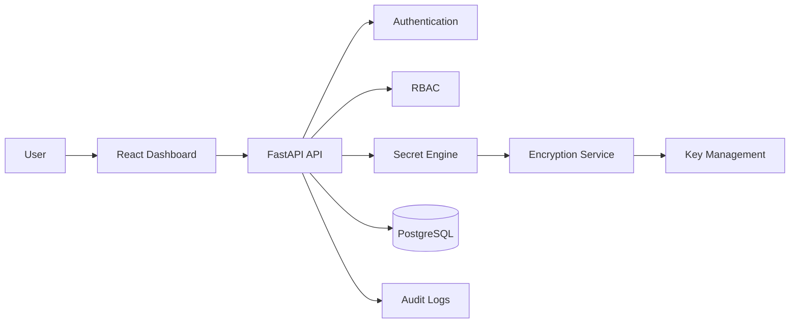

# Sentinel Vault

Sentinel Vault is a production-style secret management platform built like an internal security-team product, not a college CRUD app.

It stores application secrets securely using authentication, RBAC, audit trails, and envelope encryption.

## Why This Project Exists

Most portfolio projects show basic CRUD. Sentinel Vault is designed to demonstrate backend engineering, applied cryptography, secure system design, database modeling, API design, and production thinking.

## Core Capabilities Planned for v1.0

- User registration and login
- JWT access tokens and refresh-token rotation
- Argon2 password hashing
- Role-based access control
- AES-256-GCM secret encryption
- Envelope encryption with KEK and DEK hierarchy
- Secret create/read/update/delete with versions
- Categories, tags, and search
- Audit logging for security-sensitive events
- React dashboard for secrets, audit logs, keys, and settings
- Docker Compose local runtime
- Unit and integration tests
- Architecture, API, and threat-model documentation

## Tech Stack

| Area | Technology |
| --- | --- |
| Backend | Python 3.13, FastAPI |
| Database | PostgreSQL, SQLAlchemy, Alembic |
| Security | Argon2, JWT, AES-256-GCM, `cryptography` |
| Frontend | React, Tailwind CSS, Axios |
| Infrastructure | Docker, Docker Compose |
| Documentation | Markdown, Mermaid, OpenAPI |

## Architecture



## Documentation

- [System Architecture](docs/architecture/system-architecture.md)
- [Folder Structure](docs/architecture/folder-structure.md)
- [Database Schema](docs/architecture/database-schema.md)
- [Backend Foundation](docs/architecture/backend-foundation.md)
- [Database Engineering](docs/architecture/database-engineering.md)
- [Authentication System](docs/architecture/authentication-system.md)
- [Cryptography](docs/architecture/cryptography.md)
- [API List](docs/api/api-list.md)
- [Threat Model](docs/threat-model/README.md)

## Local Development Status

Current milestone: Phase 0 planning and scaffold.

```bash
cd C:\Dev\Active\CyberSecurity\sentinel-vault
```

Backend health endpoint exists at:

```text
GET /health
```

Docker Compose currently starts PostgreSQL only. Backend and frontend containers will be added in later phases.

## Project Roadmap

| Phase | Focus | Status |
| --- | --- | --- |
| 0 | Planning, architecture, schema, API, threat model | Complete |
| 1 | Backend foundation | Complete |
| 2 | Database engineering | Complete |
| 3 | Authentication | Complete |
| 4 | Cryptography | Complete |
| 5 | Key management | Pending |
| 6 | Secret engine | Pending |
| 7 | Audit and monitoring | Pending |
| 8 | RBAC | Pending |
| 9 | Frontend dashboard | Pending |
| 10 | Docker and deployment | Pending |
| 11 | Testing | Pending |
| 12 | Documentation polish | Pending |

## Interview Story

Sentinel Vault is built to discuss secure architecture decisions:

- Why envelope encryption is used instead of directly encrypting everything with one key
- How AES-GCM provides confidentiality and integrity
- Why refresh tokens are hashed and rotated
- Why RBAC must be enforced on the backend
- How audit logging supports incident response
- How key rotation affects secret versioning

## Security Warning

This project is educational and portfolio-oriented. Do not use it to protect real production secrets until it has been independently reviewed, tested, hardened, and deployed with a real key-management strategy.
 tested, hardened, and deployed with a real key-management strategy.
