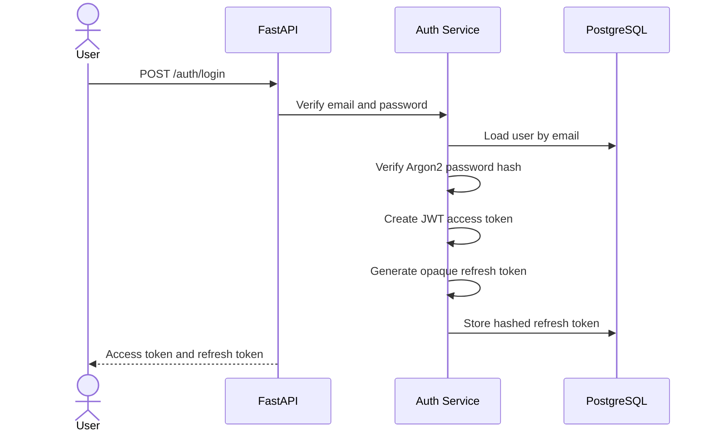

# Phase 3 Authentication System

## Goal

Build a secure authentication foundation for Sentinel Vault using Argon2 password hashing, JWT access tokens, hashed refresh tokens, refresh-token rotation, protected-route dependencies, and typed API schemas.

## What Was Built

- Register endpoint: `POST /api/v1/auth/register`
- Login endpoint: `POST /api/v1/auth/login`
- Refresh endpoint: `POST /api/v1/auth/refresh`
- Logout endpoint: `POST /api/v1/auth/logout`
- Current user endpoint: `GET /api/v1/auth/me`
- Argon2 password hashing and verification
- JWT access token creation and validation
- Opaque refresh token generation
- HMAC-SHA256 refresh-token hashing before database storage
- FastAPI dependency for protected routes

## Authentication Flow

## Security Decisions

- Passwords are hashed with Argon2, not bcrypt or SHA.
- Refresh tokens are opaque random strings, not JWTs.
- Refresh tokens are stored as HMAC-SHA256 hashes, never plaintext.
- Access tokens include `sub`, `type`, `iat`, and `exp` claims.
- Protected routes validate token type and active user state.
- Login errors are intentionally generic.

## Production Best Practices

- Use a strong `JWT_SECRET_KEY` from a secret manager in production.
- Keep access-token TTL short.
- Rotate refresh tokens on every refresh.
- Revoke refresh tokens on logout.
- Do not log passwords, raw tokens, or password hashes.
- Add rate limiting before public deployment.

## Common Mistakes Avoided

- Storing refresh tokens in plaintext.
- Returning password hashes in API responses.
- Trusting frontend-only auth state.
- Creating long-lived access tokens.
- Using reversible encryption for passwords.

## Interview Questions

1. Why use Argon2 for password hashing?
2. Why store refresh tokens hashed?
3. Why make access tokens short-lived?
4. What is refresh-token rotation?
5. Why should authorization be enforced in backend dependencies?

## Resume Bullet

Implemented Sentinel Vault's authentication foundation with Argon2 password hashing, JWT access tokens, HMAC-hashed refresh tokens, refresh-token rotation, logout revocation, protected FastAPI dependencies, and security-focused unit tests.
