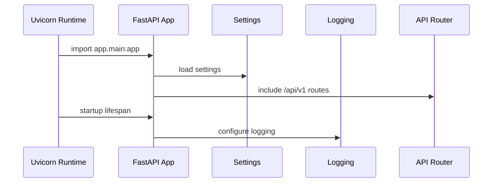

# Phase 1 Backend Foundation

## Goal

Create a professional FastAPI foundation that can grow into authentication, database access, cryptography, key management, RBAC, audit logging, and the secret engine without becoming messy.

## What Was Built

- FastAPI app factory through `create_app()`
- Versioned API router under `/api/v1`
- Health endpoint at `/api/v1/health`
- Compatibility health endpoint at `/health` for simple uptime checks
- Environment-driven settings through `pydantic-settings`
- Central logging configuration
- Dependency provider for settings
- Pydantic response schema for health checks
- Backend tests for configuration and health routing

## Runtime Flow



## Folder Changes

```text
backend/app/
├── api/
│   ├── deps.py
│   └── v1/
│       ├── health.py
│       └── router.py
├── core/
│   ├── config.py
│   └── logging.py
├── schemas/
│   └── health.py
└── main.py
```

## Production Best Practices Applied

- The app is created through a factory, which makes testing and future configuration cleaner.
- Settings are centralized and read from environment variables.
- API routes are versioned from the beginning.
- The health response is typed with a Pydantic schema.
- Startup logging is centralized instead of scattered across route handlers.

## Common Mistakes Avoided

- Hardcoding settings directly in route handlers.
- Keeping all routes in `main.py`.
- Building an unversioned API that becomes painful to evolve.
- Returning inconsistent health-check shapes.
- Mixing business logic with framework bootstrapping.

## Interview Questions

1. Why use an app factory in FastAPI?
2. Why version APIs with `/api/v1`?
3. What should and should not be included in a health endpoint?
4. Why use environment variables for configuration?
5. Why centralize logging during application startup?

## Resume Bullet

Built the FastAPI backend foundation for Sentinel Vault with versioned routing, environment-based configuration, structured startup logging, typed health checks, and testable application factory design.
