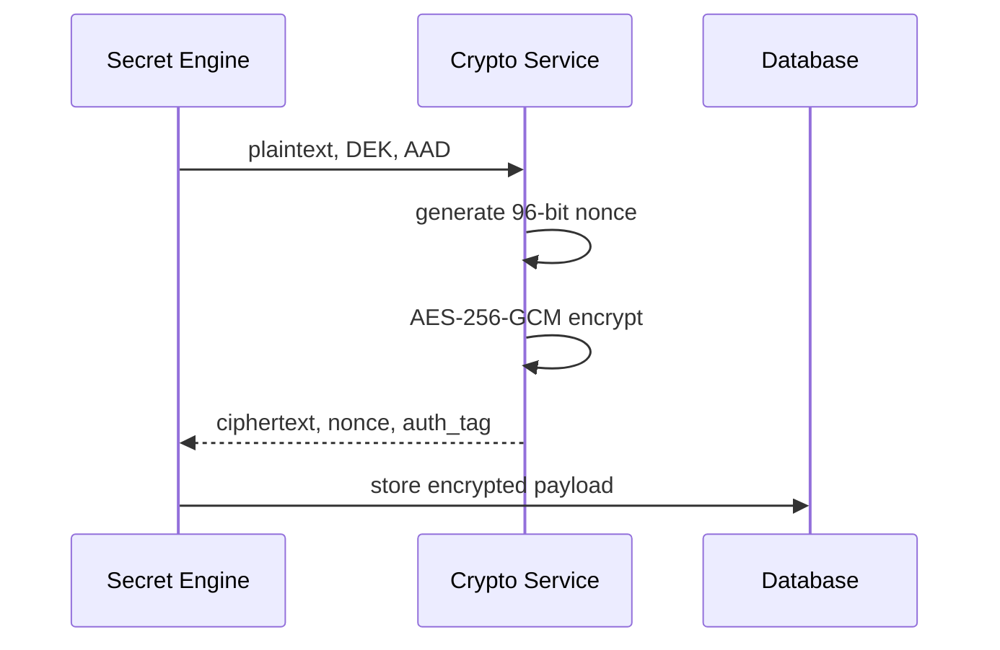
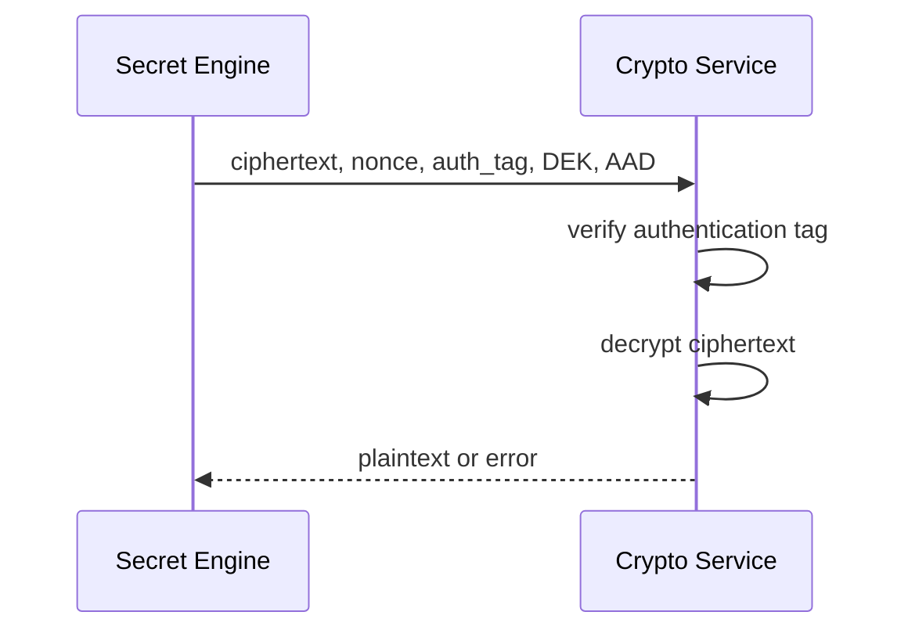

# Phase 4 Cryptography Deep Dive

## Goal

Implement Sentinel Vault's core encryption primitive using AES-256-GCM with secure key generation, nonce generation, authenticated encryption, authenticated decryption, tamper detection, and serialization helpers.

## What Was Built

- AES-256-GCM encryption service
- AES-256-GCM decryption service
- 256-bit symmetric key generator
- 96-bit nonce generator
- Authentication tag separation for database storage
- Additional Authenticated Data support
- Base64 serialization helpers for encrypted payloads
- Tests for round-trip encryption, tamper detection, AAD binding, invalid keys, and serialization

## Why AES-256-GCM

AES-GCM provides both confidentiality and integrity:

- Confidentiality: attackers cannot read ciphertext without the key.
- Integrity: attackers cannot modify ciphertext, nonce, tag, or AAD without detection.
- Authentication: the tag proves the ciphertext was produced with the correct key and context.

## Storage Shape

```text
secret_versions
├── ciphertext
├── nonce
├── auth_tag
├── dek_id
└── metadata_json
```

The authentication tag is stored separately because the database schema already models it as its own field.

## Encryption Flow



## Decryption Flow



## Security Rules

- Keys must be exactly 32 bytes.
- Nonces must be exactly 12 bytes.
- Never reuse the same nonce with the same key.
- Always preserve and verify the authentication tag.
- Use AAD to bind ciphertext to metadata such as secret ID or version.
- Never log plaintext, keys, nonces, or decrypted payloads.

## Common Mistakes Avoided

- Using AES-CBC without authentication.
- Reusing nonces.
- Ignoring authentication tag failures.
- Treating encryption as integrity protection without GCM tag verification.
- Encoding encrypted data without explicit field names.

## Interview Questions

1. What does AES-GCM protect that AES-CBC alone does not?
2. Why is nonce reuse dangerous in GCM?
3. What is Additional Authenticated Data?
4. Why should authentication tag failures be treated as security events?
5. Why does Sentinel Vault separate encryption from key management?

## Resume Bullet

Implemented Sentinel Vault's AES-256-GCM cryptography layer with secure key and nonce generation, authenticated encryption/decryption, AAD binding, tamper detection, base64 serialization, and security-focused tests.
