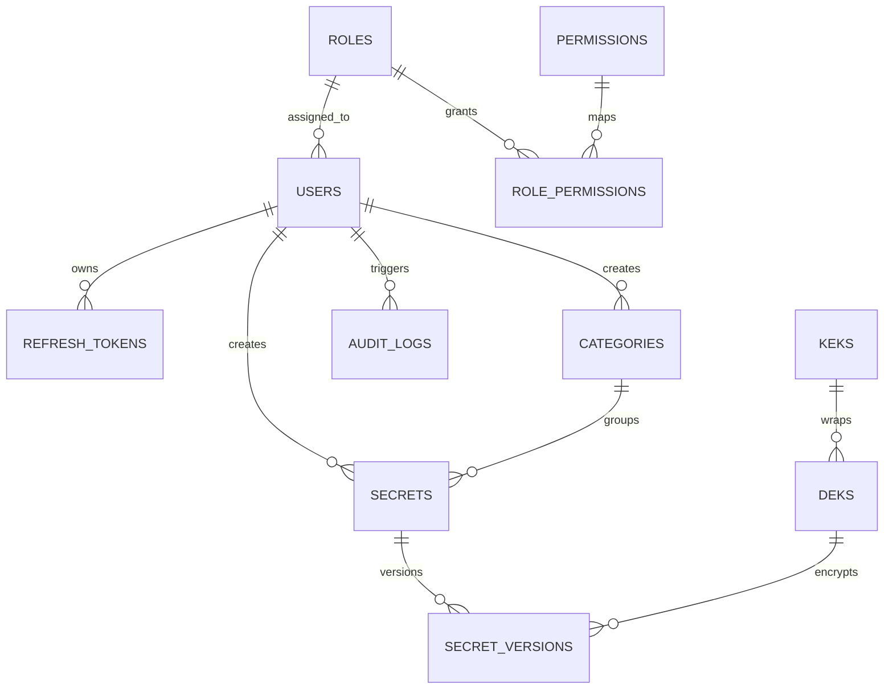

# Phase 2 Database Engineering

## Goal

Create the database foundation for Sentinel Vault using SQLAlchemy models, UUID primary keys, timestamps, relationships, indexes, and Alembic migrations.

## Tables Implemented

| Table | Purpose |
| --- | --- |
| `users` | Application users and account state |
| `roles` | RBAC role names such as admin, developer, viewer |
| `permissions` | Fine-grained backend permissions |
| `role_permissions` | Many-to-many role permission mapping |
| `refresh_tokens` | Hashed refresh-token records for rotation/revocation |
| `categories` | User-created secret grouping |
| `secrets` | Secret metadata, not plaintext values |
| `secret_versions` | Encrypted secret payload versions |
| `keks` | Key encryption key metadata |
| `deks` | Encrypted data encryption keys |
| `audit_logs` | Security-sensitive event trail |

## Design Decisions

- UUID primary keys prevent predictable record enumeration.
- `created_at` and `updated_at` exist on all core tables through a shared mixin.
- Secret metadata and encrypted secret payloads are separated.
- Refresh tokens are designed to store hashes, never raw tokens.
- Audit indexes support investigation by user, action, resource, and time.
- Key hierarchy tables support envelope encryption in later phases.

## Relationship Map



## Alembic

Migration entrypoint:

```bash
cd backend
alembic upgrade head
```

The first migration establishes the baseline schema from SQLAlchemy metadata.

## Validation

Phase 2 is validated by tests that confirm:

- All expected tables are registered in SQLAlchemy metadata.
- ORM relationships can be configured.
- Critical indexes and constraints exist.
- Alembic configuration points to the migration environment and initial revision.

## Interview Questions

1. Why use UUIDs instead of auto-incrementing integers?
2. Why separate `secrets` from `secret_versions`?
3. Why should refresh tokens be stored hashed?
4. What indexes help audit-log investigations?
5. Why use Alembic instead of manually changing the database?

## Resume Bullet

Designed Sentinel Vault's PostgreSQL schema with SQLAlchemy and Alembic, modeling users, RBAC, refresh tokens, encrypted secret versions, key metadata, categories, and audit logs with UUIDs, indexes, constraints, and relationship validation tests.
