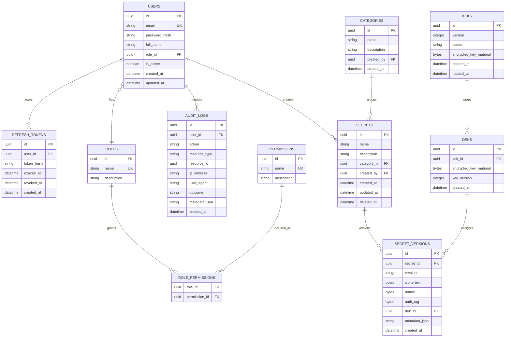

# Database Schema

## Entity Relationship Diagram

## Indexing Plan

| Table | Index | Why |
| --- | --- | --- |
| users | email unique | Login lookup |
| refresh_tokens | token_hash unique | Refresh validation |
| secrets | name, category_id | Search and filtering |
| secret_versions | secret_id, version unique | Fast latest-version lookup |
| audit_logs | user_id, created_at | User activity timeline |
| audit_logs | action, created_at | Security investigations |
| keks | version unique | Key rotation lookup |

## Normalization Notes

- Secret metadata and encrypted values are separated through `secret_versions`.
- Role permissions use a join table to avoid hardcoding authorization in user rows.
- Refresh tokens are stored hashed, not plaintext.
- Soft delete is used for secrets so audit history remains explainable.
