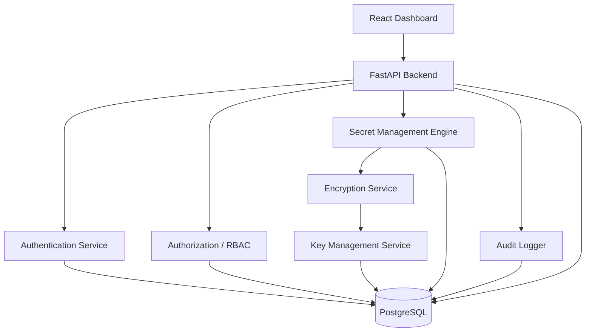
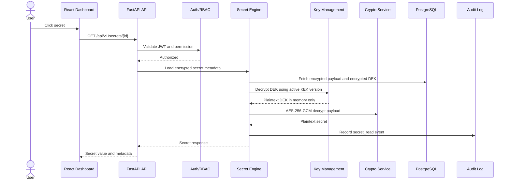

# Sentinel Vault System Architecture

## Product Boundary

Sentinel Vault v1.0 is a self-hosted secret management platform for teams that need controlled storage, retrieval, auditing, and lifecycle management of application secrets.

It is intentionally smaller than HashiCorp Vault, but it borrows the same core ideas:

- Strong authentication before secret access
- Authorization through roles and permissions
- Envelope encryption for stored secrets
- Key versioning and rotation support
- Complete audit logging for sensitive events

## High-Level Architecture

## Request Flow: Reading a Secret

## Core Services

| Service | Responsibility |
| --- | --- |
| Auth Service | Register, login, refresh tokens, logout, password hashing |
| RBAC Service | Enforce admin, developer, and viewer permissions |
| Secret Engine | Create, read, update, delete, search, categorize secrets |
| Crypto Service | AES-256-GCM encryption/decryption and nonce generation |
| Key Management Service | Master key metadata, KEK/DEK generation, key wrapping, rotation |
| Audit Service | Immutable-style event capture for security-sensitive actions |
| Config Service | Environment-driven settings and production-safe defaults |

## Security Principles

- Never store plaintext secrets in the database.
- Never log secret values, tokens, passwords, keys, or decrypted payloads.
- Keep decrypted DEKs and secrets in memory only for the shortest possible time.
- Use authenticated encryption with AES-256-GCM.
- Use Argon2 for password hashing.
- Use short-lived access tokens and refresh token rotation.
- Make authorization explicit per endpoint.
- Record all sensitive operations in audit logs.
