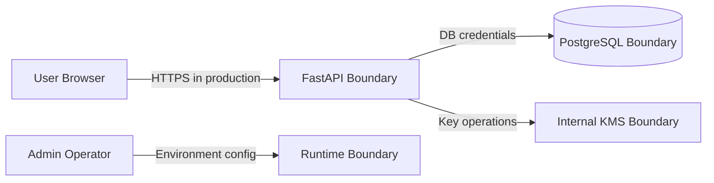

# Threat Model

## Scope

This threat model covers Sentinel Vault v1.0 as a self-hosted secret management system with a FastAPI backend, React dashboard, PostgreSQL database, JWT authentication, RBAC authorization, and envelope encryption.

## Assets

| Asset | Sensitivity | Notes |
| --- | --- | --- |
| User passwords | Critical | Stored only as Argon2 hashes |
| Access tokens | High | Short-lived JWTs |
| Refresh tokens | High | Stored hashed and rotated |
| Secret plaintext | Critical | Only exists briefly in memory |
| Secret ciphertext | High | Stored in PostgreSQL |
| DEKs | Critical | Stored encrypted by KEK |
| KEKs | Critical | Protected by master-key strategy |
| Audit logs | High | Needed for investigation and compliance |

## Trust Boundaries

## Threats and Mitigations

| Threat | CIA Impact | Mitigation |
| --- | --- | --- |
| Brute-force login | Confidentiality | Argon2, generic errors, later rate limits |
| Token theft | Confidentiality | Short access-token TTL, refresh rotation, revoke on logout |
| Broken authorization | Confidentiality/Integrity | RBAC dependency per route, permission tests |
| Secret database leak | Confidentiality | AES-256-GCM envelope encryption |
| Key compromise | Confidentiality | KEK/DEK separation and key rotation design |
| Audit log tampering | Integrity | Append-only behavior now, hash chaining later |
| Accidental secret logging | Confidentiality | Logging policy forbids sensitive fields |
| Replay or stale token use | Confidentiality | Expiry, token IDs, refresh revocation |
| SQL injection | Integrity/Confidentiality | SQLAlchemy parameterization |
| Dependency vulnerability | Integrity | Future CI vulnerability scan |

## Security Assumptions

- Production deployments use HTTPS behind a trusted reverse proxy.
- `.env` files and master-key material are not committed to Git.
- Database access is private to the application network.
- Operators protect production environment variables.

## Explicit Non-Goals for v1.0

- It is not a certified HSM.
- It is not a replacement for managed AWS/GCP/Azure KMS.
- It does not provide multi-region disaster recovery in v1.0.
- It does not support browser extensions or Kubernetes sync until post-v1.

## Security Pitfalls to Avoid During Implementation

- Do not invent custom cryptographic algorithms.
- Do not reuse AES-GCM nonces with the same key.
- Do not log plaintext secrets, raw tokens, passwords, KEKs, or DEKs.
- Do not store refresh tokens in plaintext.
- Do not return secret values from list endpoints.
- Do not implement RBAC only in the frontend.
